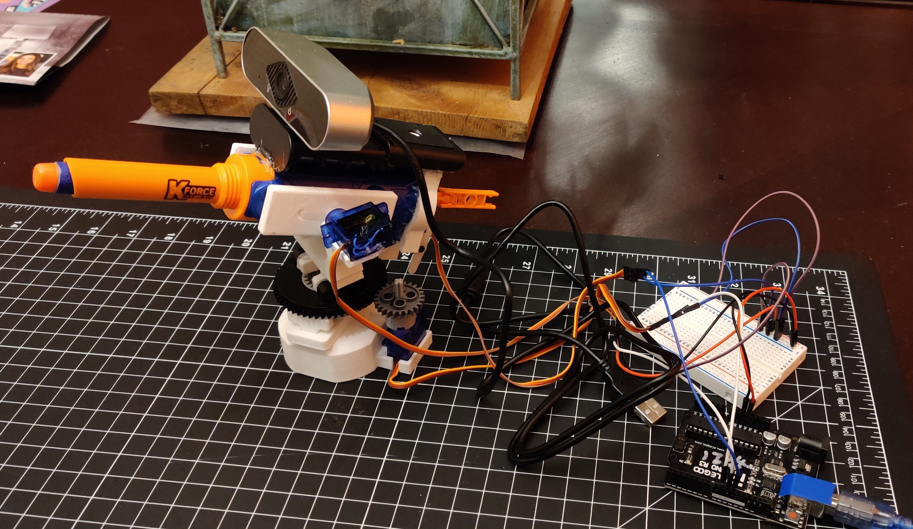

# Face Tracking Nerf Turret

*the stuff nightmares are made of*

## What exactly is that?

It's a disassembled foam dart shooter mounted to a custom 3d printed turret controlled by three servos, with a webcam slapped on top. On command it will go full Portal 2 sentry mode, and track the nearest humanoid head to launch squishy missiles of death at.

